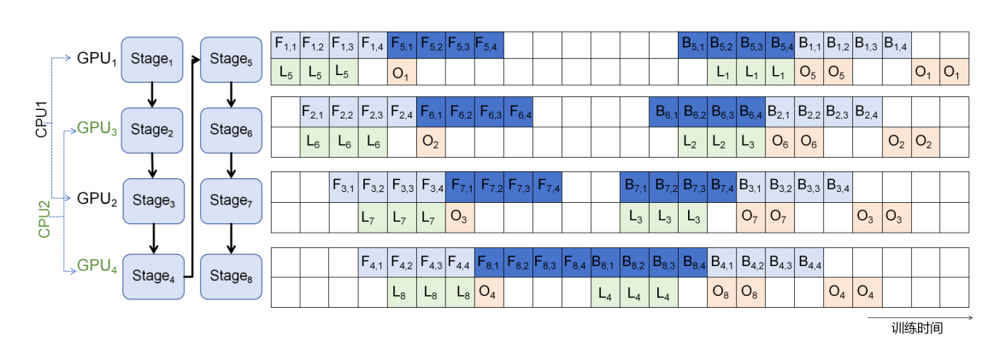
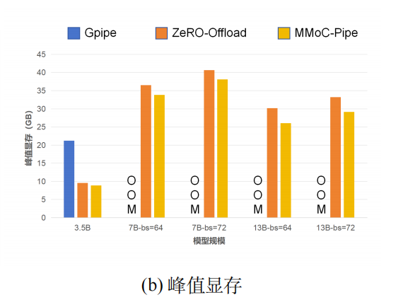
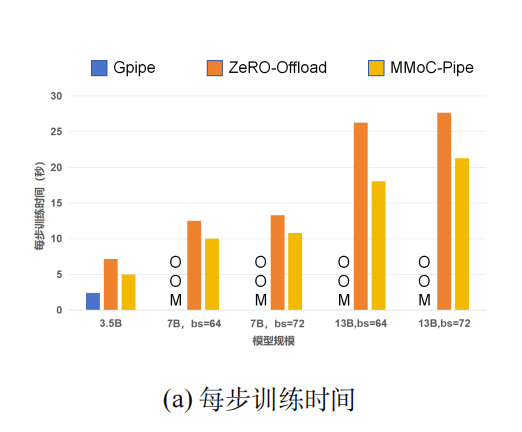
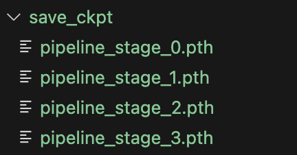

# MMoC-Pipe：基于流水线并行、卸载策略和交叉映射的低资源大语言模型全量微调

## 🚀 简介

本仓库包含了 **MMoC-Pipe**（基于流水线并行、卸载策略和交叉映射的低资源大语言模型全量微调）的官方实现，这是一个专为资源受限环境（单节点、低GPU内存和PCIe通信）下大语言模型全量微调设计的新颖系统。

## 🎯 问题陈述

大语言模型（LLMs）的全量微调在低资源环境中面临重大挑战：
- **内存瓶颈**：即使是LLaMA-2（7B/13B）等模型全量精调也需要大量GPU内存
- **硬件限制**：商用GPU的内存和带宽有限
- **训练效率**：需要优化资源利用率和提高训练速度

## 💡 我们的解决方案

MMoC-Pipe通过创新结合**流水线并行**、**动态内存卸载**和**交叉映射**来解决这些挑战：

### 核心创新点
- **单设备多阶段策略**：传统流水线并行将模型层分割为N个阶段，其中N表示GPU数量。我们采用虚拟流水线策略，将模型层分割为v×N个阶段，每个GPU轮流执行v个流水线阶段。以N=4，v=2为例。8个虚拟阶段（v×N=2×4）在4个GPU间循环分布：GPU1处理阶段1和5，GPU2处理阶段2和6，GPU3处理阶段3和7，GPU4处理阶段4和8。
- **模型卸载**：在训练过程中动态将模型参数卸载到CPU，为激活值和梯度节省高带宽内存（HBM）。
- **通信-计算重叠**：优化流水线执行，使得模型移动带来的通信和计算操作尽量重叠，减少设备计算资源空闲时间
- **交叉映射**：战略性地放置流水线阶段以最小化通信开销
- **多流多线程执行**：并发数据移动和计算以提高吞吐量

### 系统架构

   如上图所示，𝐹_{i,j} 表示第𝑖 个阶段第 𝑗 个微批次的前向传播，𝐵_{i,j} 表示第 𝑖 个阶段第 𝑗 个微批次的反向传播，𝐿_i 表示将第 𝑖 个阶段的模型参数从 CPU 加载至 GPU，𝑂_𝑖 表示将第 𝑖 个阶段的模型参数（和梯度）从 GPU 卸载至 CPU。反向传播时 𝑂_𝑖 的时间跨度大于前向传播时 𝑂𝑖 的时间跨度，因为反向传播时除了卸载模型参数，还需要卸载模型参数梯度。每个 GPU 负责 k 个模型阶段，这里以 k=2 为例。模型共分为 8 个阶段，GPU1 负责 stage1 和 stage5，GPU2 负责 stage2 和 stage6，以此类推。GPU1 和 GPU3 连接同一个 CPU 根复合体，GPU2 和 GPU4 连接另一个 CPU 根复合体。为了缓解带宽争用现象，我们设计错开同一个 CPU 根复合体下不同 GPU 的通信，比如错开 𝐿_5和 𝐿_7 的执行时间。 
   系统初始化时所有设备同步加载第一阶段模型参数，以 GPU2 为例，其首先接收来自 GPU1 的中间激活张量完成 Stage 2 前向计算，随后并行执行 Stage 2 前向传播与 Stage 6 参数预加载；待前向计算完成后立即释放 Stage 2 显存资源并启动 Stage 6 完整前向传播，随后通过梯度传输接口等待接收 Stage 7 的反向梯度信号，触发 Stage 6 反向计算与 Stage 2 参数重载的同步执行；在完成反向传播运算后，系统将导出 Stage 6 梯度数据并清空对应显存，继而加载 Stage 2 完整参数，最终实现 Stage 2 反向传播与参数-梯度卸载操作的并行化处理。

## 📊 性能亮点

我们的实验结果显示相比现有方法有显著改进：

- **成功全量微调** LLaMA-2（7B/13B）在4×L20商用GPU上
- **GPU内存减少3倍** 相比GPipe（仅使用流水线架构）

  
- **训练速度提升25%** 相比ZeRO-Offload
  
  
- **增强的可扩展性** 支持更大的批量大小和序列长度

## 🎯 目标用例

本实现适用于：
- **研究人员** 在有限GPU资源下工作
- **开发者** 寻求高效的LLM微调解决方案
- **组织机构** 在高端硬件预算受限的情况下
- **学术机构** 使用共享计算资源

## 🔧 系统要求

- NVIDIA GPU（在L20上测试，可适配其他型号）
- CUDA兼容环境
- 足够的CPU内存用于卸载操作
- CPU-GPU互连（支持PCIe）

## 📚 快速开始

1. 您可以直接使用下面的docker文件，或根据environment.yml在本地安装环境。
   
   `docker pull coir1hat1man/mobius:latest`
3. 根据您的实际需求修改fine_tune.yaml中的设置。以下是所有可调参数功能的描述。
    | 参数 | 值 | 描述 |
    |------|----|----- |
    | `batch_size` | 64 | 每个训练批次处理的样本数量 |
    | `num_chunks` | 4 | 微批次数量 |
    | `seq_length` | 128 | 输入token的最大序列长度 |
    | `embedding_dim` | 4096 | 嵌入层的维度 |
    | `ff_dim` | 4096 | transformer块中前馈网络的维度 |
    | `num_iterations` | 2 | 要运行的总训练迭代次数 |
    | `num_stages` | 8 | 模型并行的流水线阶段数 |
    | `num_layers` | 32 | 此参数应根据您模型的规格配置。您也可以将其设置为小于模型总层数的值来模拟较小的架构。|
    | `num_heads` | 32 | 多头注意力中的注意力头数量 |
    | `model` | "llama-2-7b-hf" | Hugging Face上的模型名称 |
    | `dataset` | "xsum" | 用于微调的数据集名称，数据集必须已在本地下载。|
    | `save_results` | "test_result.txt" | 保存训练信息（包括训练时间、内存使用）的文件路径 |
    | `save_dir` | "save_ckpt" | 保存模型检查点的目录 |
    | `use_prefetch` | true | 启用数据预取以提高训练效率 |
    | `use_offload` | true | 启用模型参数卸载以减少GPU内存使用 |
    | `cuda_visible_devices` | "0,2,1,3" | 用于训练的GPU设备ID（流水线阶段的特定顺序） |
    | `master_port` | 29502 | 分布式训练通信的端口号 |
4. 运行train.sh。
`bash train.sh`

### 🔬 示例：在XSum数据集上微调LLaMA-2-7B
此示例演示如何使用我们的MMoC-Pipe系统通过提供的配置文件在XSum数据集上微调LLaMA-2-7B模型。

1. 使用fine_tune.yaml中的设置。
2. 运行 `bash train.sh`
3. 微调结束后获得检查点
   
   

## 🤝 贡献

我们欢迎社区的贡献。

## 📧 联系方式
如果您有任何问题，请提出issue或通过liuhm59@mail2.sysu.edu.cn联系我们。

